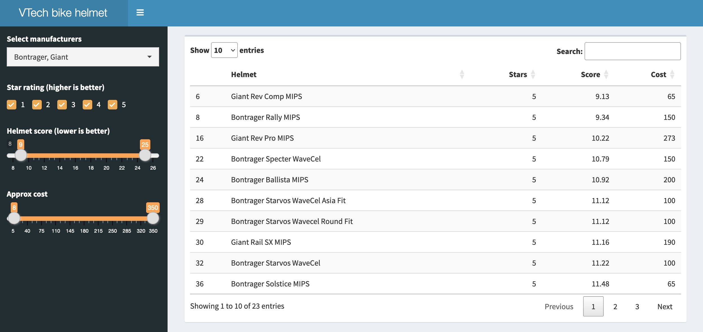

## R Shiny app for viewing bike helmet safety data ##

#### About this project ####
The app displays Virginia Tech's 2022 bike helmet safety data, with the added ability to filter by manufacturer, safety score, star rating, and cost. 

#### Running the app online ####
The app runs online at this link:
[https://huiwen-goy.shinyapps.io/project_shiny_bike/](https://huiwen-goy.shinyapps.io/project_shiny_bike/)

#### Running the app on a local computer ####
* Install R and R Studio, and R packages 'shiny', 'shinydashboard', 'DT', and 'shinyWidgets'.
* Save the csv data file to the same directory as the app.R file.
* In R Studio, set the working directory to the folder containing the app.R file. Open the app.R file. Click the "Run" button, or use the runApp() function.
